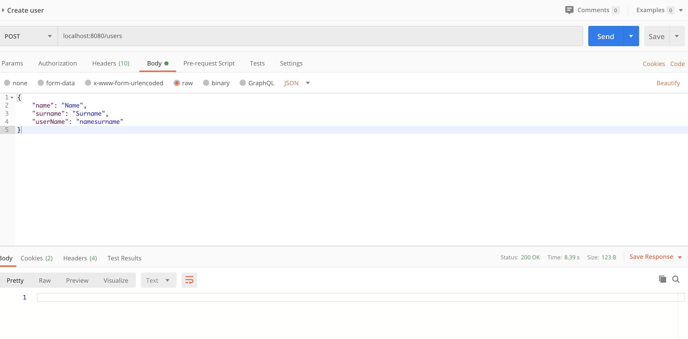
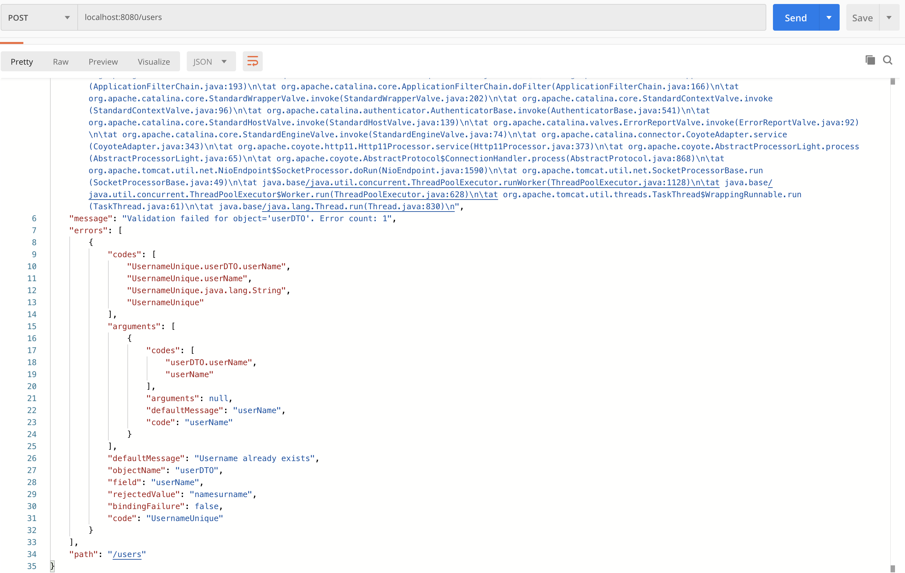

# Constraints project example
This project contains example about Custom Constraint Validation.

### Usage: 
* Request body:
```
{
	"name": "Name",
	"surname": "Surname",
	"userName": "namesurname"
}
```
* On postman - to create a user:

[](#create-user)

* On postman - after trying to create a user with same name:


[](#create-user-error)
